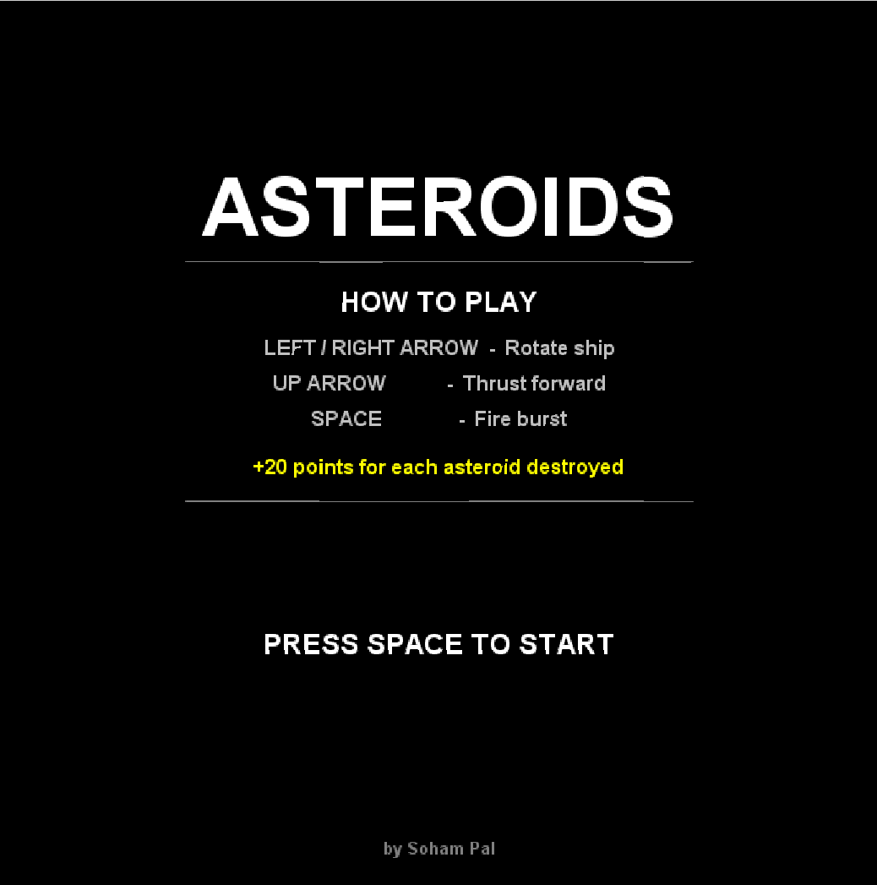
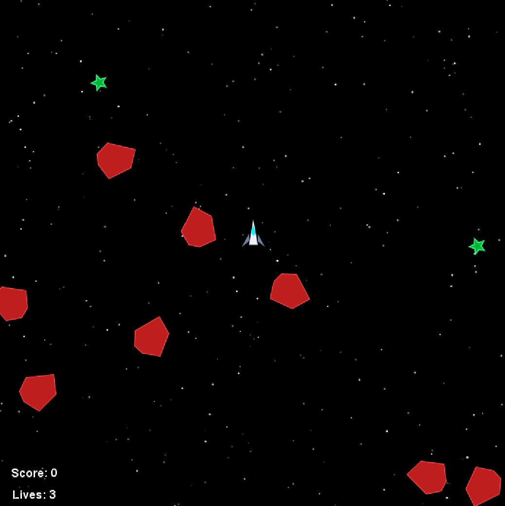

# Asteroids

A classic Asteroids arcade game written in Java, built on Princeton's [StdDraw](https://introcs.cs.princeton.edu/java/stdlib/StdDraw.java.html) graphics library.


---

## Gameplay

Navigate your ship through a field of drifting asteroids. Shoot them down to rack up points — but don't let them hit you! You have 3 lives. Lose them all and it's game over.

### Controls

| Key | Action |
|-----|--------|
| `←` / `→` | Rotate ship |
| `↑` | Thrust forward |
| `Space` | Fire burst |
| `Space` (Game Over) | Restart |
| `Esc` (Game Over) | Return to title screen |

### Scoring

* Each asteroid destroyed: **+20 points**

---

## Project Structure

```
AsteroidsGame/
├── screenshots/
│   ├── main_menu.png         # Main menu screenshot
│   └── gameplay.png          # Gameplay screenshot
├── src/
│   ├── GameDriver.java       # Entry point; manages START / PLAYING / GAME_OVER states
│   ├── AsteroidsGame.java    # Core game loop (update + draw)
│   ├── Ship.java             # Player ship
│   ├── Asteroid.java         # Spinning asteroids
│   ├── Burst.java            # Projectiles fired by the ship
│   ├── Star.java             # Background starfield
│   ├── SpaceObject.java      # Abstract base class for all game objects
│   ├── Position.java         # 2-D position with heading
│   ├── Point.java            # 2-D point
│   ├── VelocityVector.java   # 2-D velocity vector
│   ├── GameConstants.java    # Screen size, colors, timing constants
│   ├── GameUtils.java        # Drawing helpers (triangles, polygons, thrust)
│   ├── SoundEffect.java      # Audio effects for shooting, explosions, and powerups
│   ├── PowerUp.java          # Shield power-up mechanics
│   └── StdDraw.java          # Princeton StdDraw graphics library (bundled)
├── .gitignore                # Git exclusions (bytecode, highscore, IDE files)
├── LICENCE                   # Project license (MIT)
└── README.md                 # Project documentation
```

---

## Running the Game

### Requirements

* Java 8 or later ([download](https://www.java.com/en/download/))

### Compile & Run

```bash
# From the project root
javac src/*.java -d out
java -cp out GameDriver
```

Or in one step (Java 11+):

```bash
cd src
javac *.java && java GameDriver
```

---

## Screenshots

### Main Menu


### Gameplay


---

## Architecture Overview

```
GameDriver  ──controls──►  AsteroidsGame
                               │
               ┌───────────────┼───────────────┐
               ▼               ▼               ▼
             Ship          Asteroid[]        Star[]
               │               │
             Burst[]       SpaceObject (abstract)
                               │
                           Position / VelocityVector
```

All moving objects extend `SpaceObject`, which handles wrap-around screen movement via modular arithmetic on the canvas dimensions.

---

## Features

* Sound effects for shooting, power-ups, and explosions
* High-score persistence across sessions
* Multiple asteroid sizes with split-on-hit behavior
* Glowing green star shield power-ups
* Modern spaceship design with animated thrusters and solid-filled glowing red asteroids

---

## Author

**Soham Pal** — built as a Java OOP project (May 2023).

---

## License

This project is licensed under the **MIT License** — see [LICENSE](LICENSE) for details.  
`StdDraw.java` is © Princeton University and is redistributed under its own permissive licence.